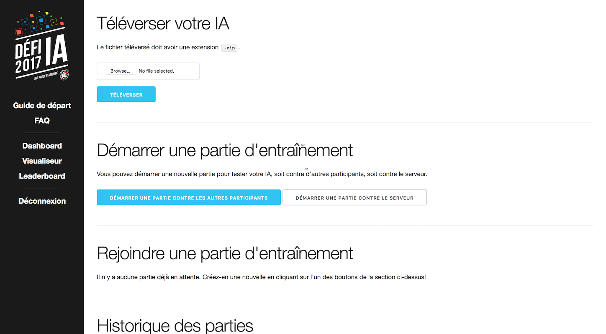
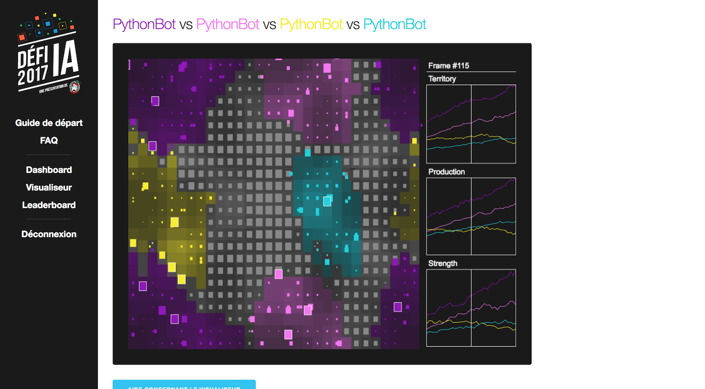

# JDIS AI Challenge 2017
This project was made for our 2017 AI challenge and uses [Halite.io](https://halite.io/) as its game platform. The project consists of many pieces:

- A simple Web interface that lets players test their bots against other teams before the official matches
- An admin page that lets the organizers start official matches between the participating teams
- A match visualizer (based on the official Halite.io visualizer)
- Some explanation pages: FAQ, starting guide, etc.

Here's a screenshot of the admin interface (in French):



## Platform Features
- Can run matches in the background
- Allows players to create practice matches against other players or bots
- Lets players watch their previous matches
- Lets admins start official (ranked) matches
- Lets admins disable the site for players (to prevent the players from knowing the outcome of the final round matches)
- Runs with Docker Compose, so it's pretty easy to setup (`docker-compose up`)
- Has a leaderboard for ranked matches that players can see
- Provides a basic scoring system: each consecutive round gives more points to the players than the previous one
- Provides 3 bots, which can be used by players for practice matches, and for admin to fill up matches to 4 players. Note: Bot 3 is better than bots 1 and 2 (which are just random bots)
- Provides 4 starter packs (Python, Javascript, C++ and C#), which contain scripts to test locally on GNU/Linux, macOS and Windows
- Provides basic A\* algorithm implementation for the starter pack languages
- Automatically runs database migrations (including the initial migrations) with a dedicated Docker container

Here's a screenshot of the game visualizer (in French):



## How to Install

1. [Install Docker and Docker Compose](https://docs.docker.com/compose/install/).
2. Copy the `env.example` file to `.env`, and edit this `.env` file to setup all the variables as needed. The `WEB_SECRET` variable can be generated with `openssl rand -hex 48`. These variables will be shared between the Docker containers
3. Run `docker-compose up`. The first time you do so, the `runner` container will complain that the database doesn't contain certain tables. Don't panic: just wait a few seconds and the automatic database migrations will start, after which everything should run fine.

## Notes
- **Don't run this on the Internet.** All matches are ran in the same container, so players can easy screw up the system if they want to.
- Most of the code should be in English, but keep in mind that the UI is in French, so you may need to translate. Let us know if you need some help with that.
- Be careful if you open the database port on your firewall (PostgreSQL port: 5432).
- Round 0 is just a practice round: it doesn't give points to players. You can change the round in the admin UI.
- Don't hesitate to rebrand the site. The branding was made for our CS student association.
- There's an issue with the JavaScript starter package: the A\* algorithm isn't working properly.

## I want to contribute, what can I do?
- [ ] Translate the front-end to English
- [ ] Make every single match run in its own container, without access to the network or anything else
- [ ] Fix the A\* algorithm of the JavaScript starter package
- [ ] Add support for other languages

### Database Migrations
The database tables are maintained by `alembic`, which can be installed using `virtualenv`. To do so, navigate to `/scripts/database` and run the following: 

```
virtualenv . && source bin/activate && pip install -r requirements.txt
```

If you need to change the tables, create a new migration script with `alembic revision -m "my revision"`. You will need to restart the `migration` container for it to automatically run the new migration(s). You can then find your new version under the `versions` folder and make the necessary changes.
